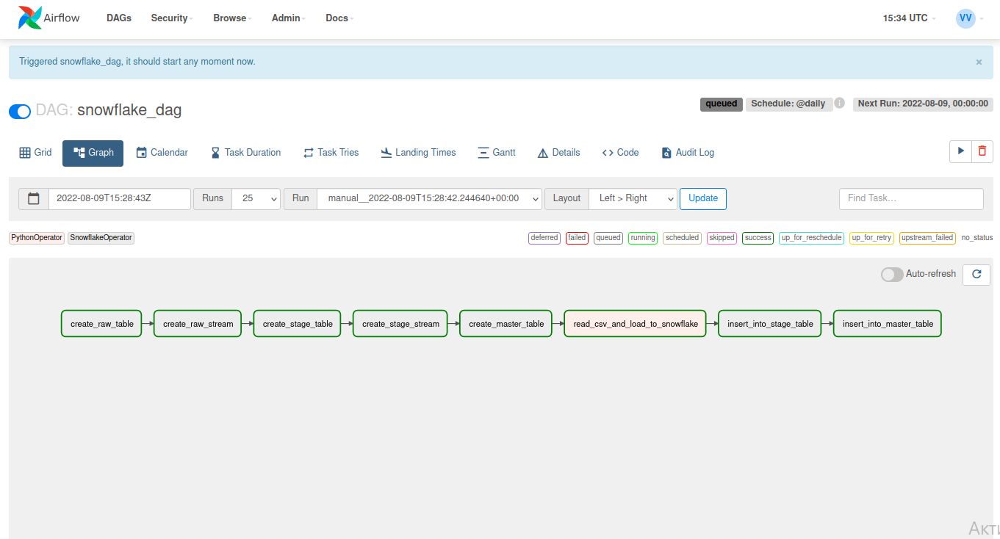
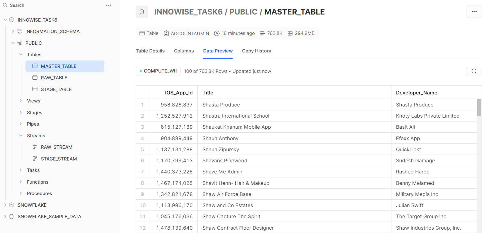

# Task 6. Snowflake

To start airflow

```shell
airflow webserver -D
airflow scheduler -D
```

Requirements

```shell
pip install pandas
pip install snowflake-connector-python
pip install "snowflake-connector-python[pandas]"
pip install --upgrade snowflake-sqlalchemy
pip install apache-airflow-providers-snowflake
```

Code for dag

```python
import snowflake.connector
from airflow.models import Variable
from airflow.operators.python import PythonOperator
import pandas as pd
from airflow.providers.snowflake.operators.snowflake import SnowflakeOperator
from datetime import datetime
from airflow import DAG
from snowflake.connector.pandas_tools import write_pandas

FILE_PATH = Variable.get('file_path')
USER = Variable.get('user')
PASSWORD = Variable.get('password')
ACCOUNT = Variable.get('account')
WAREHOUSE = Variable.get('warehouse')
DATABASE = Variable.get('database')
SCHEMA = Variable.get('schema')
TABLE = 'RAW_TABLE'
IF_EXISTS = 'replace'


def read_clean_and_load():
    raw_df = pd.read_csv(FILE_PATH)
    raw_df.drop('_id', axis=1, inplace=True)
    conn = snowflake.connector.connect(
        user=USER,
        password=PASSWORD,
        account=ACCOUNT,
        warehouse=WAREHOUSE,
        database=DATABASE,
        schema=SCHEMA
    )
    write_pandas(conn, raw_df, TABLE)


default_args = {
    'owner': 'airflow',
    'depends_on_past': False,
    'email_on_failure': False,
    'email_on_retry': False,
}

with DAG('snowflake_dag',
         start_date=datetime(2022, 8, 9),
         max_active_runs=1,
         schedule_interval='@daily',
         default_args=default_args,
         template_searchpath='/home/vlad/airflow/include',
         catchup=False
         ) as dag:
    create_raw_table = SnowflakeOperator(
        task_id='create_raw_table',
        sql='create_raw_table.sql',
        snowflake_conn_id='snowflake'
    )
    create_raw_stream = SnowflakeOperator(
        task_id='create_raw_stream',
        sql='create_raw_stream.sql',
        snowflake_conn_id='snowflake'
    )
    create_stage_table = SnowflakeOperator(
        task_id='create_stage_table',
        sql='create_stage_table.sql',
        snowflake_conn_id='snowflake'
    )
    create_stage_stream = SnowflakeOperator(
        task_id='create_stage_stream',
        sql='create_stage_stream.sql',
        snowflake_conn_id='snowflake'
    )
    create_master_table = SnowflakeOperator(
        task_id='create_master_table',
        sql='create_master_table.sql',
        snowflake_conn_id='snowflake'
    )

    insert_into_stage_table = SnowflakeOperator(
        task_id='insert_into_stage_table',
        sql='insert_into_stage_table.sql',
        snowflake_conn_id='snowflake'
    )
    insert_into_master_table = SnowflakeOperator(
        task_id='insert_into_master_table',
        sql='insert_into_master_table.sql',
        snowflake_conn_id='snowflake'
    )

    read_csv_and_load_to_snowflake = PythonOperator(
        task_id='read_csv_and_load_to_snowflake',
        python_callable=read_clean_and_load
    )

create_raw_table >> create_raw_stream >> create_stage_table >> create_stage_stream >> create_master_table >> read_csv_and_load_to_snowflake >> insert_into_stage_table >> insert_into_master_table
```



#### Queries to create tables and streams

Raw/Stage/Master table

```snowflake
CREATE TABLE IF NOT EXISTS INNOWISE_TASK6.PUBLIC.RAW_TABLE (
"IOS_App_Id" NUMBER(38,0),
"Title" VARCHAR(16777216),
"Developer_Name" VARCHAR(16777216),
"Developer_IOS_Id" FLOAT,
"IOS_Store_Url" VARCHAR(16777216),
"Seller_Official_Website" VARCHAR(16777216),
"Age_Rating" VARCHAR(16777216),
"Total_Average_Rating" FLOAT,
"Total_Number_of_Ratings" FLOAT,
"Average_Rating_For_Version" FLOAT,
"Number_of_Ratings_For_Version" NUMBER(38,0),
"Original_Release_Date" VARCHAR(16777216),
"Current_Version_Release_Date" VARCHAR(16777216),
"Price_USD" FLOAT,
"Primary_Genre" VARCHAR(16777216),
"All_Genres" VARCHAR(16777216),
"Languages" VARCHAR(16777216),
"Description" VARCHAR(16777216)
);
```

Raw/Stage stream
```snowflake
CREATE STREAM IF NOT EXISTS INNOWISE_TASK6.PUBLIC.RAW_STREAM ON TABLE INNOWISE_TASK6.PUBLIC.RAW_TABLE;
```

Copy from stream to table
```snowflake
INSERT INTO INNOWISE_TASK6.PUBLIC.STAGE_TABLE
SELECT "IOS_App_Id",
       "Title",
       "Developer_Name",
       "Developer_IOS_Id",
       "IOS_Store_Url",
       "Seller_Official_Website",
       "Age_Rating",
       "Total_Average_Rating",
       "Total_Number_of_Ratings",
       "Average_Rating_For_Version",
       "Number_of_Ratings_For_Version",
       "Original_Release_Date",
       "Current_Version_Release_Date",
       "Price_USD",
       "Primary_Genre",
       "All_Genres",
       "Languages",
       "Description"
FROM INNOWISE_TASK6.PUBLIC.RAW_STREAM;
```

Result

